# XH-202621 岗位能力图谱项目技术路线与需求文档

_面向数字经济新一代信息技术岗位的多源异构数据驱动动态能力图谱系统；版本 1.0；2026-08-25_

---

## 📋 项目概述

本项目面向数字经济时代的岗位能力动态演化与人岗精准匹配需求，建设一套“数据采集—可信治理—岗位发现与更新—时序知识图谱—人岗诊断—学习推荐”的闭环系统。系统以招聘 JD、企业官网、技术社区、课程与认证、公开报告等多源异构数据为基础，结合讯飞星火大模型、知识图谱与 RAG，形成可追溯、可校验、可人工修订的岗位能力大脑。

本文件将项目目标拆解为可实现的创新点、技术路线、产品需求、数据与算法需求、验收指标和实施计划。竞赛材料中的约束以附件为准：岗位范围聚焦人工智能、大数据、智能系统、物联网等新一代信息技术；核心指标为 JD 解析准确率、简历技能提取准确率和人岗匹配准确率均不低于 90%；测试方案至少包含 100 条岗位 JD 及测试用例；单元测试覆盖率不低于 60%。

> 📌 **范围说明：** 本文是项目设计与研发需求文档，不把附件中的赛事说明误当作系统功能；赛事硬指标被转化为验收标准，系统仍需由团队根据真实数据和实测结果最终确认。

## 🎯 目标与成功标准

### 项目目标

系统应完成以下闭环：

1. 发现并定义尚未标准化或正在兴起的新岗位。
2. 识别既有岗位能力要求的新增、删除、修改和权重变化。
3. 在技能点粒度展示新一代信息技术岗位全景图谱，并支持技术栈、行业和岗位级别切换。
4. 解析 PDF、Word 等格式简历，输出候选人的技能证据与岗位匹配诊断。
5. 给出能力差距、优先补齐技能和个性化学习路径。
6. 对每一条图谱结论保留数据来源、时间、证据片段、置信度和人工修改记录。

### 成功标准

| 类别 | 验收目标 | 验证方式 |
| --- | --- | --- |
| 全流程完整性 | 数据采集到匹配推荐闭环可运行 | 端到端演示 + 集成测试 |
| JD 解析 | 准确率 ≥ 90% | 100+ 条人工标注测试集 |
| 简历提取 | 技能要素准确率 ≥ 90% | PDF/Word 混合测试集 |
| 人岗匹配 | 匹配准确率 ≥ 90% | 专家标注或双人复核金标准 |
| 数据可信 | 每项关键结论可追溯，幻觉结论可拦截 | 证据覆盖率、幻觉率、抽样审计 |
| 图谱动态性 | 支持时间切片、版本比较和回滚 | 版本回放测试 |
| 工程质量 | 单元测试覆盖率 ≥ 60% | CI 覆盖率报告 |
| 部署交付 | Docker 一键启动，健康检查可用 | 评审环境部署演练 |

## 💡 核心创新点

### 可信数据评分驱动的多源交叉验证

提出“可信度评分—证据融合—图谱更新”一体化机制，不把所有 JD 或模型抽取结果等权使用。对每条岗位、技能和关系计算来源权威性、时效性、跨源一致性、文本完整性、重复/抄袭风险、抽取置信度和人工确认状态，并输出可解释的可信度分数。只有达到阈值或经过人工确认的证据，才允许进入高影响图谱更新。

建议的证据评分形式为：

```text
Trust(e) = w_s SourceAuthority + w_t Freshness + w_c CrossSourceAgreement
           + w_q ExtractionQuality - w_d DuplicationRisk - w_h HallucinationRisk
```

权重不应写死在代码中，应通过配置和验证集校准；最终报告同时给出分项得分，便于答辩解释。

### 招聘数据“抄袭—噪声—通胀—时滞”联合治理

将招聘数据问题从普通清洗提升为可量化的质量诊断。通过 SimHash/MinHash 检测模板复制，通过语义聚类识别岗位说明书家族，通过技能密度、稀有技能比例和职责—技能一致性识别能力通胀，通过时间衰减和来源发布时间处理 JD 时滞。系统不仅删除低质量数据，还保留“疑似复制”“过期”“技能通胀”等标签，让评审看到数据问题被识别、解释和治理。

### 面向大模型幻觉的证据约束与拒答机制

采用“RAG 检索片段 + 结构化 JSON Schema + 证据 span + 交叉蕴含校验 + 低置信度拒答”的五道防线。模型生成岗位定义或能力关系时，必须绑定来源片段；若无法在输入证据中找到支持，系统返回“待核验”而不是生成看似合理的技能。对高影响结论保留原文证据、引用来源和验证状态，形成可审计的 claim-evidence graph。

### 时序动态岗位能力图谱与能力生命周期

把岗位能力图谱建模为带有效时间和观测时间的版本化图谱。技能节点与岗位之间的关系包含强度、必备/加分属性、熟练等级、来源数量、置信度和时间区间；岗位和技能同时具有“萌芽—增长—稳定—衰退”生命周期。通过滑动时间窗、趋势加速度、跨行业扩散度和语义新颖度检测能力变化，避免只展示静态共现词云。

### 新岗位发现与可解释定义生成

先用岗位标题—技能—行业共现图和嵌入聚类生成候选岗位，再用增长率、跨来源一致性、行业覆盖、与既有岗位的语义距离和人工确认状态排序。大模型只负责在证据约束下生成“岗位名称、核心职责、必备技能、加分技能、典型场景”五元定义，并返回支持每个字段的证据，形成“算法发现 + 模型表达 + 人工确认”的新岗位定义流程。

### 细粒度人岗匹配与学习路径闭环

将简历中的技能、项目、时间、成果和熟练度映射到统一技能本体；匹配时区分硬门槛、核心技能、迁移技能和可学习技能，并结合技能新鲜度、项目证据和岗位权重计算多维匹配结果。差距分析直接连接技能先修关系和课程/认证资源，使用带优先级的技能 DAG 生成学习路径，而不是只返回一个总分。

### 人在回路的图谱治理与可回滚演化

为专家提供证据审阅、批量接受/驳回、合并技能、调整权重、修改岗位定义和版本回滚能力。所有修改记录操作者、时间、旧值、新值、理由和影响范围；模型建议不直接覆盖生产图谱，关键变更必须经过人工确认或达到明确的自动发布阈值。

## 🏗️ 技术路线

### 总体路线图

下面的路线图以“证据先于结论、版本先于覆盖、反馈驱动更新”为主线，覆盖竞赛要求的完整闭环。

```mermaid
flowchart LR
    accTitle: 岗位能力图谱技术路线
    accDescr: 从多源招聘与能力数据开始，经可信治理、大模型抽取、时序知识图谱和人工审核，最终输出新岗位发现、能力更新、人岗匹配与学习路径推荐

    source([📥 多源数据]) --> ingest[⚙️ 采集与解析]

    subgraph trust_layer ["🛡️ 可信数据治理"]
        clean[🔧 去重与清洗] --> score[📊 可信度评分]
        score --> evidence[📝 证据片段库]
    end

    subgraph semantic_layer ["🧠 语义与本体"]
        extract[🧠 结构化抽取] --> normalize[🔗 技能标准化]
        normalize --> validate[🔍 交叉验证与拒答]
    end

    subgraph graph_layer ["💾 时序能力图谱"]
        graph_write[📦 版本化写入] --> graph_diff[🔄 时间切片与变更检测]
        graph_diff --> role_mining[💡 新岗位发现]
    end

    subgraph app_layer ["🎯 应用闭环"]
        panorama[📊 全景图谱] --> match[👤 人岗匹配诊断]
        match --> learn[🎓 学习路径推荐]
        role_mining --> panorama
    end

    ingest --> clean
    evidence --> extract
    validate --> graph_write
    graph_diff --> panorama
    review[👥 专家审核与反馈] --> graph_write
    match --> review

    classDef input fill:#ede9fe,stroke:#7c3aed,stroke-width:2px,color:#3b0764
    classDef process fill:#dbeafe,stroke:#2563eb,stroke-width:2px,color:#1e3a5f
    classDef data fill:#dcfce7,stroke:#16a34a,stroke-width:2px,color:#14532d
    classDef decision fill:#fef9c3,stroke:#ca8a04,stroke-width:2px,color:#713f12

    class source input
    class ingest,clean,score,extract,normalize,validate,graph_write,graph_diff,role_mining,panorama,match,learn process
    class evidence data
    class review decision
```



### 核心闭环说明

1. **采集层：** 统一接入招聘 JD、企业官网、技术社区、课程/认证、行业报告和用户简历，保存原始文档、来源、抓取时间和版本哈希。
2. **治理层：** 完成格式解析、语言检测、字段标准化、近重复检测、时效衰减、异常标记和 PII 脱敏。
3. **语义层：** 通过讯飞星火进行职位职责、技能、熟练度、行业和上下文关系抽取，再用技能词典、向量相似度和规则进行标准化。
4. **验证层：** 使用 RAG 提供证据上下文，进行来源交叉验证、实体对齐、蕴含/冲突检测和置信度校准；无法证实时拒答或进入人工审核队列。
5. **图谱层：** 以岗位、技能、职责、行业、项目、课程和证据为核心实体，以“需要、属于、先修、应用于、替代、演化为”等为关系，采用版本化和时间有效区间保存演化。
6. **应用层：** 输出新岗位定义、既有岗位变更说明、技能级全景图谱、简历解析、人岗匹配、差距分析和学习路径。
7. **反馈层：** 记录专家修订和用户反馈，用于更新阈值、权重、技能别名和抽取评测集，形成可持续迭代闭环。

### 关键算法与数据结构

| 模块 | 推荐实现 | 关键输出 |
| --- | --- | --- |
| 文档解析 | PDF/Word 解析 + OCR 兜底 | 标题、正文、表格、页码、证据 span |
| 近重复检测 | SimHash/MinHash + 句向量聚类 | duplicate_group、duplication_risk |
| 技能标准化 | 词典、别名表、向量召回、人工合并 | canonical_skill、alias、skill_version |
| LLM 抽取 | 讯飞星火 + JSON Schema + RAG | role、skill、requirement、evidence |
| 交叉验证 | 多源投票、NLI/规则冲突检测 | agreement、conflict、verification_status |
| 趋势检测 | 滑动窗口、增长率、变点检测 | emergence_score、trend_state |
| 新岗位发现 | 标题/技能聚类 + 新颖度 + 行业扩散 | candidate_role、role_definition |
| 人岗匹配 | 硬门槛过滤 + 加权相似度 + 证据评分 | match_score、gap_items、explanations |
| 学习推荐 | 技能先修 DAG + 路径优化 | learning_path、estimated_effort |

建议的核心图谱实体为 `Role`、`Skill`、`Responsibility`、`Industry`、`Evidence`、`Resume`、`Course` 和 `Version`；所有高影响关系必须带 `source_id`、`observed_at`、`valid_from`、`valid_to`、`confidence`、`trust_score` 和 `review_status`。

## 📋 需求规格

### 角色与使用场景

| 角色 | 目标 | 主要操作 |
| --- | --- | --- |
| 企业招聘/人才发展人员 | 了解岗位能力变化并精准招聘 | 查看岗位变更、导入简历、匹配诊断 |
| 求职者/学生 | 了解目标岗位差距并规划学习 | 查看能力图谱、上传简历、生成学习路径 |
| 行业研究人员 | 发现新岗位和技术趋势 | 查询时间切片、比较行业和岗位 |
| 图谱专家 | 审核和维护知识质量 | 审核证据、合并技能、发布版本、回滚 |
| 系统管理员 | 保证系统可部署、可观测、安全运行 | 数据源配置、权限、日志、健康检查 |

### 功能需求

#### FR-01 多源数据接入

- 支持 JD、企业官网、技术社区、课程/认证、行业报告和简历等数据源。
- 支持 HTML、PDF、DOCX、TXT、CSV/JSON 等格式。
- 保存来源 URL 或文件哈希、采集时间、来源类型、语言、版本和授权状态。
- 支持手动上传和批量导入；采集失败必须记录可重试任务。

#### FR-02 数据清洗与可信度评分

- 识别空字段、异常字符、过期内容、模板复制、重复岗位和技能通胀。
- 输出 `quality_flags` 和 `trust_score`，并展示分项解释。
- 支持按来源、时间、行业和风险标签筛选数据。
- 低可信证据不得直接覆盖已发布图谱；需进入待审核队列。

#### FR-03 JD 解析与岗位能力抽取

- 抽取岗位名称、职责、必备技能、加分技能、经验、学历、技术栈、行业场景和熟练度。
- 每个抽取字段必须关联证据片段和来源。
- 输出结构化 JSON；字段缺失、冲突或无法验证时标记为 `unknown`，不得编造。
- JD 解析准确率目标不低于 90%，并提供字段级评测报告。

#### FR-04 新岗位发现与定义

- 基于时间窗口发现岗位标题、技能组合和职责模式的异常增长簇。
- 输出候选岗位排序、发现依据、相似旧岗位、行业覆盖和趋势曲线。
- 生成岗位名称、核心职责、必备技能、加分技能和典型应用场景。
- 支持专家编辑、合并、驳回、发布和版本回滚。

#### FR-05 既有岗位能力动态更新

- 支持选择岗位和两个时间窗口进行能力对比。
- 明确展示新增、删除、修改的能力项及其来源、时间和置信度。
- 支持岗位级别、技术栈和行业筛选。
- 每次更新生成变更摘要和可审计版本号。

#### FR-06 新一代信息技术岗位全景图谱

- 以技能点为最小展示粒度。
- 支持按岗位、技能、行业、技术栈、级别和时间切片浏览。
- 节点详情展示来源数量、证据片段、可信度、首次/最近出现时间和生命周期状态。
- 支持导出图谱子图、岗位画像和变化报告。

#### FR-07 简历解析与技能证据抽取

- 支持 PDF、DOCX 等格式简历。
- 提取技能、项目、职责、年限、成果、证书、教育和时间范围。
- 保留技能出现位置和项目证据，支持人工修正。
- 简历技能提取准确率目标不低于 90%。

#### FR-08 人岗匹配诊断

- 支持选择目标岗位或自定义岗位需求。
- 先执行硬门槛校验，再计算技能、经验、项目证据、技能新鲜度和迁移能力维度得分。
- 输出总匹配度、维度分数、已满足项、缺失项、风险项和解释证据。
- 匹配准确率目标不低于 90%，并支持专家标注校准。

#### FR-09 个性化学习路径

- 将缺失技能映射到技能先修关系和课程/认证资源。
- 根据岗位目标、当前水平、预计投入时间和优先级生成路径。
- 输出阶段目标、先修技能、推荐资源、预计时长和完成标准。
- 支持用户反馈“已掌握/不相关/推荐有效”并更新排序。

#### FR-10 人工审核与版本治理

- 提供证据审阅、字段级修改、批量审核、差异比较和回滚。
- 记录操作者、时间、理由、旧值、新值、影响关系和发布状态。
- 支持草稿、待审核、已发布、已废弃四种状态。
- 高风险或低可信变更必须阻断自动发布。

#### FR-11 评测与演示

- 提供至少 100 条岗位 JD 及对应标注、测试用例和结果报告。
- 覆盖新岗位发现、既有岗位更新、JD 解析、简历提取、匹配和幻觉拦截。
- 提供一键运行的评测脚本、混淆矩阵/误差样例和指标汇总。
- 支持 10 分钟内演示：新岗位发现 + 既有岗位更新 + 简历匹配闭环。

### 非功能需求

| 类别 | 要求 |
| --- | --- |
| 可解释性 | 关键结论均可回溯到证据、来源和时间 |
| 可靠性 | 外部模型、数据源失败时可降级、重试和人工补录 |
| 性能 | 常规查询 3 秒内返回；批处理支持异步任务和进度 |
| 安全 | 简历 PII 脱敏、角色权限、密钥不入库、操作审计 |
| 可扩展性 | 数据源、LLM、向量库、图数据库均采用适配器接口 |
| 可维护性 | 关键模块有单元测试；整体覆盖率不低于 60% |
| 可部署性 | 提供 Dockerfile、环境变量模板、初始化脚本和健康检查 |
| 可复现性 | 固化数据快照、模型版本、提示词版本、阈值和评测集版本 |

## 🔗 API 与数据契约

### 核心 API 草案

| 方法 | 路径 | 作用 |
| --- | --- | --- |
| `POST` | `/api/v1/ingestion/jobs` | 创建数据导入任务 |
| `GET` | `/api/v1/ingestion/jobs/{id}` | 查询导入状态和质量报告 |
| `POST` | `/api/v1/roles/discover` | 发现候选新岗位 |
| `GET` | `/api/v1/roles/{id}/timeline` | 获取岗位能力演化时间线 |
| `POST` | `/api/v1/resumes/parse` | 解析简历并返回技能证据 |
| `POST` | `/api/v1/matching/diagnose` | 执行人岗匹配和差距分析 |
| `POST` | `/api/v1/learning-paths` | 生成个性化学习路径 |
| `POST` | `/api/v1/reviews/{id}/approve` | 审核并发布图谱变更 |
| `GET` | `/api/v1/metrics/evaluation` | 返回评测集指标和错误样例 |

### 关键数据对象

```json
{
  "claim_id": "claim-0001",
  "subject": "新兴岗位候选-01",
  "predicate": "requires_skill",
  "object": "rag-evaluation",
  "source_id": "jd-0123",
  "evidence_span": "负责构建检索增强生成评测流程",
  "observed_at": "2026-08-20",
  "valid_from": "2026-08-20",
  "valid_to": null,
  "trust_score": 0.87,
  "confidence": 0.91,
  "verification_status": "verified",
  "review_status": "pending"
}
```

## 🧪 测试与评测方案

### 测试集设计

测试集至少包含 100 条 JD，按岗位类别、行业、企业规模、时间和文本质量分层；另建简历测试集和专家匹配金标准。不得只用单一来源或同模板数据，否则无法验证抗抄袭和跨源泛化能力。

### 指标定义

| 指标 | 定义 | 目标 |
| --- | --- | --- |
| JD 字段准确率 | 字段级 Precision/Recall/F1 的综合结果 | ≥ 90% |
| 简历技能准确率 | 技能实体和标准化结果的 F1 | ≥ 90% |
| 匹配准确率 | 与专家金标准一致的 Top-1/分档准确率 | ≥ 90% |
| 证据覆盖率 | 有证据 span 的关键结论占比 | ≥ 95% |
| 幻觉率 | 无证据支持却被发布的关键结论占比 | ≤ 2% |
| 重复识别 F1 | 模板/重复 JD 识别 F1 | ≥ 90% |
| 新岗位发现质量 | 专家确认的候选岗位 Precision@K | 设定 K 后报告 |
| 图谱新鲜度 | 更新后有效时间内的证据占比 | 分时间窗报告 |

### 必测场景

1. 多份高度相似的 JD：验证复制检测和不重复计权。
2. 过期 JD 与最新技术资料并存：验证时效衰减和版本更新。
3. 模型无法从证据推出的技能：验证拒答和人工审核。
4. 同义技能、缩写和中英文混写：验证技能标准化。
5. 项目中出现但技能栏缺失的简历：验证证据级技能提取。
6. 硬门槛缺失但软技能较多的候选人：验证匹配解释而非单一总分。
7. 新岗位候选簇与既有岗位相近：验证新颖度和合并/驳回流程。

## 🚀 实施路线与交付物

### 分阶段计划

| 阶段 | 重点工作 | 交付物 | 验收门槛 |
| --- | --- | --- | --- |
| M0 需求冻结 | 明确岗位范围、指标、数据授权和金标准 | 需求基线、字段字典、评测协议 | 团队确认 |
| M1 数据底座 | 接入样例数据、解析、去重、脱敏 | 原始数据快照、清洗管线 | 可重复运行 |
| M2 可信抽取 | LLM Schema、RAG、证据链、评分模型 | 抽取服务、质量报告 | 抽样可追溯 |
| M3 图谱与动态 | 本体、版本、时间切片、变更检测 | 图谱服务、岗位时间线 | 可回放 |
| M4 应用闭环 | 新岗位、更新、全景图、匹配、学习路径 | Web Demo、API | 端到端可用 |
| M5 评测与加固 | 100+ JD、误差分析、消融、压力测试 | 评测报告、测试代码 | 三项准确率达标 |
| M6 提交包装 | Docker、PPT、10 分钟视频、方案文档 | 提交压缩包 | 材料齐全 |

### 推荐答辩演示顺序

1. 选择 AI/大数据领域，展示数据源和可信度分层。
2. 展示一个新岗位候选簇，展开五元岗位定义及证据。
3. 对既有岗位切换两个时间窗口，展示新增/删除/修改技能。
4. 上传 PDF 或 Word 简历，展示技能证据和解析置信度。
5. 选择目标岗位，展示匹配分解、差距、风险和学习路径。
6. 点击一条结论，回溯原始来源、时间和审核记录，演示幻觉拦截。

## ⚠️ 风险与决策

| 风险 | 影响 | 应对 |
| --- | --- | --- |
| 数据源授权或接口不稳定 | 无法稳定复现 | 使用授权公开数据快照、适配器和离线缓存 |
| JD 模板复制导致趋势虚高 | 新岗位误判 | 近重复聚类、来源去重、企业/时间分层计权 |
| 大模型生成无证据技能 | 图谱污染 | RAG、证据 span、蕴含校验、拒答和人工门禁 |
| 技能本体覆盖不足 | 匹配偏差 | 别名表、人工合并、版本化本体和未知类保留 |
| 指标口径不一致 | 答辩争议 | 提前冻结标注指南、金标准和计算脚本 |
| 简历包含敏感个人信息 | 合规风险 | 脱敏、最小化保存、访问控制和删除机制 |
| 目标范围过大 | 无法按时交付 | 先锁定 2–3 个领域、1 个新岗位和 1 个既有岗位做 MVP |

## 🔗 依据与附录

- [竞赛方案附件](C:/Users/Administrator/Desktop/XH-202621_多源异构数据驱动岗位和能力图谱构建与动态演化分析研究.pdf) — 项目背景、功能要求、评分标准和提交要求。
- 本文中的阈值和功能优先级以竞赛材料为基线；实际系统须以最终标注集和评测脚本结果为准。

_Last updated: 2026-08-25 · Maintained by project team_
